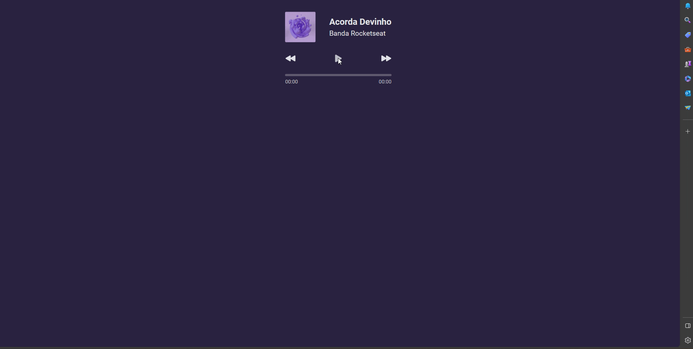
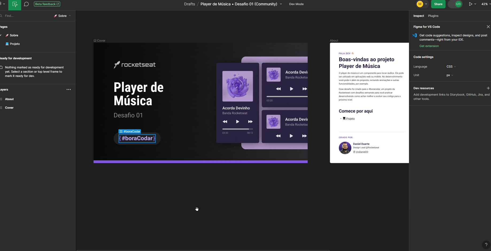

# [Music Player]() 🚀



This repository is the solution to [#boraCodar um player de música](https://www.rocketseat.com.br/boracodar#) by [Rocketseat](https://www.rocketseat.com.br/). 

The objective of this project was the development of a music player!

## Design

This Front-end project was developed based on the design proposed in [Figma](https://www.figma.com/file/toCNbYGd4RjuIxvU8MXtk1/Player-de-M%C3%BAsica-%E2%80%A2-Desafio-01-(Community)?type=design&node-id=1%3A62&mode=dev).



## Technologies

This project was developed using HTML, CSS and Javascript

## Run Project

Click on `index.html`and 😝 Enjoy!!

## What I Learned with This Project?

### Audio Controls

This project help me to learn about audio controls in Javascript. My control functions were:

```js
const updateProgressBar = () => {
    const progressPercentage = (audioPlayer.currentTime / audioPlayer.duration) * 100
    progress.style.width = `${progressPercentage}%`;
}

const updateMusicProgress = () => {
    const progressInSeconds = audioPlayer.currentTime;
    const durationInSeconds = audioPlayer.duration

    timeProgress.textContent = formatTimeProgress(progressInSeconds)
    timeEnd.textContent = formatTimeProgress(durationInSeconds - progressInSeconds)

    updateProgressBar()
}

const playAudio = () => {
    if(audioPlayer.paused){
        audioPlayer.play()
        setInterval(updateMusicProgress, 500);
    }else{
        audioPlayer.pause()
    }   
}
```

## Acknowledgment

Thanks to [Rocketseat](https://www.rocketseat.com.br/) for this challenge and initiatives it provides.🚀
